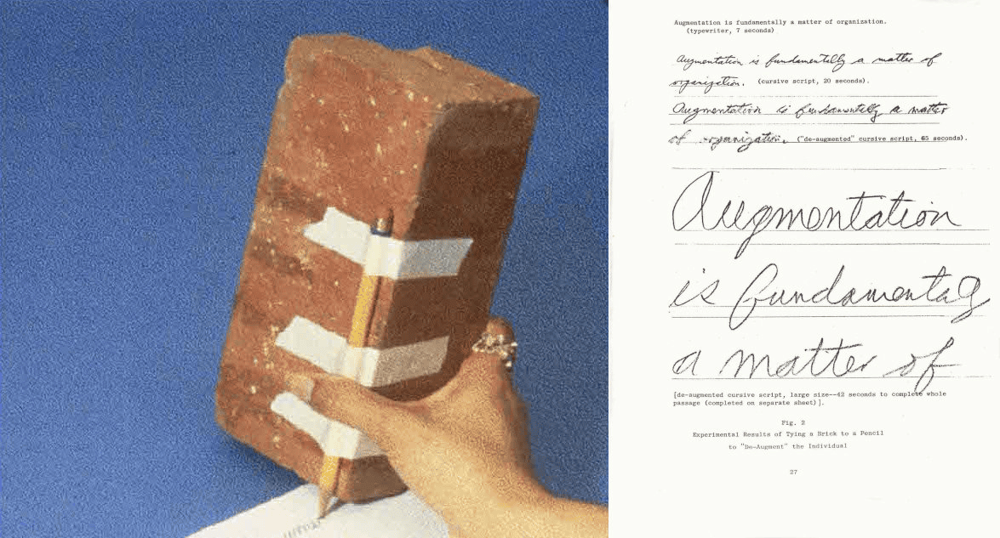

# Code and Interfaces Art 754

Instructor: **Alvin Ashiatey**

Course Assistant: **Theo France-Haggins** [Office Hours: By Appointment]

## Statement

_Douglas C. Engelbart. Tying a Brick to a Pencil to "De-Augment" the Individual_

This course delves into the digital tools central to contemporary graphic design, challenging students to move beyond the confines of industry-standard software. It offers a platform for reimagining existing technologies and exploring the creation of custom digital tools. Through a blend of lectures, group discussions, hands-on workshops, and a culminating project, students will engage critically and creatively with digital media.
Designed for those eager to innovate within new media, this course requires no prior experience in software development. Workshops will introduce a range of tools and techniques—including p5.js, Processing, Drawbot, InDesign scripting, web scraping, OpenCV, and natural language processing—equipping students with the skills to expand their digital proficiency and adopt a more experimental approach to design.

- Meets Thursday, 10:00-1:00 pm.
- Class will meet in-person on campus at least once early in the semester.
- The class will periodically meet as a whole group, but most of the four hours will be spent cycling small discussion/presentation groups made up of 2-4 students.

## Course Description

> “A tool is not produced to carry out a defined utilitarian task. Tools are born as challenges to existing concepts of utility. They open up new understanding of what could be useful. Utility is not a given unambiguous need. Ambiguity about utility is what drives new forms of utility.”
>
> Beatriz Colomina & Mark Wigley, are we human?: notes on an archaeology of design.

In 1968, Douglas Engelbart famously demonstrated the transformative power of well-designed tools through an experiment involving a pencil taped to a brick. This “de-augmented” tool deliberately hindered the user, emphasizing how the design and ergonomics of tools profoundly shape human capabilities and experiences. The clumsiness of the brick-penciled contraption served to underscore how thoughtful tool design can not only solve problems but also shape the very way we think and act.

Today, tools and interfaces are seamlessly embedded into every aspect of our lives. Their ubiquity often renders them invisible, even as they profoundly influence the ways we create, communicate, and navigate the world. This course challenges the notion, perpetuated by major tech companies, that tools are neutral. Drawing on Bruno Latour’s Actor-Network Theory, we will critically examine tools as active agents that shape, constrain, and reconfigure social structures and creative practices.

Through texts like Anthony Huberman’s Make it Thick (accompanying the 2017 exhibition Mechanisms at the CCA Wattis Institute), we will explore how complexity and inefficiency can be intentional design choices. Huberman’s advocacy for “impossible tools,” purposeful inefficiencies, and intricate protocols invites us to rethink the relationship between tool design, usability, and creative output. What happens when we disrupt the conventions of utility? How can the deliberate misuse of tools uncover new potentials?

This course is an exploration of the critical, creative, and speculative possibilities of tools in design and art practices. Students will engage in hands-on experiments to complicate tools—whether by extending their functionality through scripting, misusing them in unexpected ways, or inventing entirely new tools. These investigations aim to surface novel utilities and insights, “thickening” our understanding of what tools can do and how they mediate human experience.

## Course Objectives

- Critically analyze the role of tools and interfaces in shaping creative practices, drawing on historical, philosophical, and contemporary perspectives.
- Explore the potential of disruption, de-augmentation, and misuse as creative strategies to challenge conventional tool use.
- Develop new tools, protocols, or workflows that reflect critical and speculative approaches to design.
- Share findings through a collaborative workshop format and create thorough documentation to articulate process and insights.

## Course Structure

Throughout the semester, students will:

- Engage with Theoretical Frameworks: Readings and discussions will provide a foundation for understanding tools as active participants in design and cultural practices.
- Experiment with Tools: Students will extend, misuse, or invent tools to explore their creative and critical potential.
- Produce Documentation: Projects will culminate in comprehensive documentation, reflecting the process, outcomes, and insights gained, to be presented during the final critique.

Students are encouraged to integrate ideas or projects from other classes or thesis work, allowing this course to intersect meaningfully with their broader academic and creative goals. Together, we will interrogate, disrupt, and expand the role of tools, unveiling their unseen potential and reimagining their place within creative practice.

## Schedule

Find the schedule [here](https://docs.google.com/document/d/e/2PACX-1vRVC8Cwu-7bVNYvnduRSu64fnrroUcVvjKVCVsNkL1dZty-N1wLTTqlKdZwn6kkDDh4FX9Ns4at4sB5/pub).

## Readings

Weekly assigned readings and active participation in group discussions are essential components of this course. Together, we will collaboratively create a **class commonplace book**—a shared space for collecting and reflecting on ideas.

A commonplace book is a curated collection of quotes, thoughts, and media that capture insights, provoke questions, or spark inspiration. After each reading, you are required to contribute:

- A selected quote from the text that resonated with you.
- A brief reflection in the form of text, image, or video explaining why you chose that quote and its relevance to your thinking.

These contributions will be shared on our Arena channel, building a collective archive of our intellectual journey. Please refer to the schedule for more details.

## Project

The goal of this course is to collaboratively develop a shared toolbox of design tools. In this class, a tool is not neutral or purely functional. It is a designed system that holds a process or way of working from your practice and shapes how actions are taken, decisions are made, and meanings are produced. Each student will individually propose and develop a tool they would use themselves and invite others to use. Over the course of the semester, these tools will circulate within the class, contributing to a collective toolbox.

Each tool should make clear how a process operates, repeats, or changes over time, and what assumptions, constraints, or values are built into it. Tools act as interfaces through which systems are accessed, performed, and understood, so attention to interface design is essential. Students are expected to think critically about both what is visible in their tool and what remains hidden, including technical choices, forms of labor, cultural norms, and institutional or social structures that shape how the tool functions and how it is experienced.

As part of the project, students are required to produce a video documentation of at least five minutes that showcases their tool in use. This video should not be treated as neutral documentation. Instead, it should be approached as an opportunity to reinterpret the tool through a different medium. Students are encouraged to edit, frame, and structure the video as a new video work inspired by the tool, rather than a straightforward explanation or demonstration.

## Toolbox of Friction

For this one-week group project, you will engage critically with the tools you use in your practice by introducing deliberate frictions into their functionality. Drawing inspiration from the reading material provided, select one or more tools from your own practice and pair them with a prompt of friction from this [are.na channel](https://www.are.na/art-754-code-and-interfaces-2025/friction-modifiers). These prompt serve as a starting point for your group project but you are encouraged to modify or expand upon them as needed.

Your task is to create a work that responds to this intersection, designed specifically for the department’s 60-inch screen and staged in the atrium. This project invites you to explore how slowing down, disrupting, or complicating familiar workflows can reveal unexpected creative potentials and provoke deeper engagement.

References for Inspiration:

- [Designing Friction by Luna Maurer, Roel Wouters, and Alexandra Barancová](https://designingfriction.com/)
- [Anthony Huberman - Make it Thick: Introductory text for the exhibition “Mechanisms.”](https://attachments.are.na/25819836/a0ec81bfbff63ada03658abea9e4d0c7.pdf?1705775021)
- [The Slow Media Manifesto by Benedikt Koehler, Sabria David, and Joerg Blumtritt](https://raw.githubusercontent.com/greyscalepress/manifestos/master/content/manifestos/2010-01-02-Slow-Media-Manifesto.txt)

As you develop your project, consider how friction can challenge assumptions, alter experiences, or spark new interactions. Let this be an opportunity to reflect on the ways friction can be as generative as it is disruptive.

## Class Are.na Group

This class will utilize an Are.na group as a central hub for sharing, collaborating, and documenting throughout the semester. If you do not already have an Are.na account, please create one and use the provided [group invite link](https://www.are.na/group/art-754-code-and-interfaces-2025/invite/RrBLhgKgjy4LbyuMsVjZoQ) to join the class group. Participation in the group is essential for tracking progress and fostering collaboration.

## Documentation

For all projects developed in this class, thoughtful and thorough documentation is required. Each student will have an assigned Are.na channel for individual projects, and a shared channel will be created for collaborative projects. Use these channels to document your process, including sketches, iterations, prototypes, final outputs, and reflections. Regular updates to your channel are expected as part of your participation in the course.

## Attendance

Attendance is crucial. Accumulating three or more absences will lead to a failing grade. Additionally, being late three times (over 10 minutes late) will be counted as one absence.
If you must miss a class, please email me in advance and include Siri in the correspondence.

## Workshops

- [Terminal/Shell Scripting](https://github.com/Code-Interfaces/shell-scripting)
- [Adobe scripting](#)
- [DrawBot](#)
- [Processing](#)
- [Web Scraping](#)
- [Encoding/Decoding Images](#)
- [Computer Vision](#)

## Credits

This course is heavily inspired and influenced by courses taught by Mindy Seu (On-gathering), Ayham Ghraowi (Fictive Interfaces), and Rosa McElheny (Software for people). A big thank you to Avery Youngblood for all the feedback while developing this syllabus and Theo France-Haggings for being the TA for this class.
